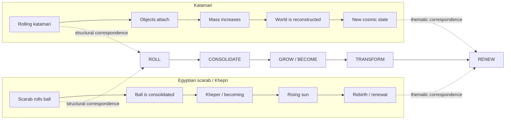

# Correlation Map

## The shared transformation grammar



---

## Six-dimensional overlap

| Feature | Katamari | Scarab/Khepri | Reading |
|---|:---:|:---:|---|
| Rolling / circular motion | ● | ● | Shared |
| Central ball/sphere | ● | ● | Shared |
| Consolidation | ● | ● | Shared |
| Growth / becoming | ● | ● | Shared |
| Cosmic transformation | ● | ● | Shared |
| Renewal / rebirth | ● | ● | Shared |

### Visual key

**● = feature explicitly identified in the current research set**

This is a **feature map**, not a probability chart.

---

## Three layers of evidence

```text
                 ┌─────────────────────────────┐
                 │  HISTORICAL INFLUENCE        │
                 │  "Did one influence the      │
                 │   other?"                    │
                 │  STATUS: OPEN                │
                 └──────────────┬──────────────┘
                                │
                 ┌──────────────▼──────────────┐
                 │  STRUCTURAL CORRELATION      │
                 │  "Do their transformation    │
                 │   patterns overlap?"         │
                 │  STATUS: STRONG OBSERVATION  │
                 └──────────────┬──────────────┘
                                │
                 ┌──────────────▼──────────────┐
                 │  DOCUMENTED COMPONENTS       │
                 │  Rolling, becoming, solar    │
                 │  renewal, accumulation, etc. │
                 │  STATUS: SOURCED             │
                 └─────────────────────────────┘
```

## Read the diagram correctly

The map deliberately **does not draw a causal arrow from ancient Egypt to Katamari**.

Instead, it asks a narrower and testable question:

> **How many meaningful structural components can be independently aligned?**

Current answer: **6 identified dimensions**.

That makes the Egyptian path worth investigating without turning a compelling resemblance into an unsupported historical claim.

---

## Next expansion

Every new cultural path should enter the same matrix.

For each path, record:

1. **Source evidence**
2. **Structural features**
3. **Transformation sequence**
4. **Documented influence evidence, if any**
5. **Contradictory evidence**
6. **Confidence/status**

This lets the project grow into a comparative **symbolic transformation network** rather than a collection of loose analogies.
